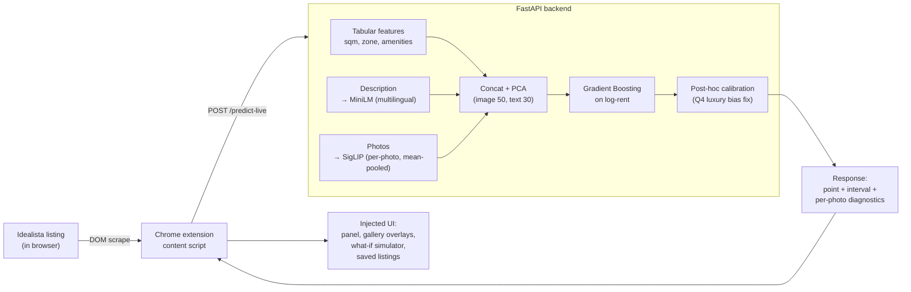

# madrid-rental-vision

I wanted to see whether a photo of a flat tells you how much it rents for, on top of the obvious stuff (size, zone, bedrooms). It does, and the answer got a lot stronger after a review surfaced two methodology bugs and pushed me to swap the image encoder. The headline numbers, what changed between versions, and where each piece lives in the repo are summarised in the table below.

Dataset isn't in this repo (coursework + licensing). Code, trained models, evaluation results, and the Chrome extension are. Bring your own listings CSV and everything re-runs.

> **Reading order for graders:** this section explains the v1/v2 split. [Results](#results) gives the per-model numbers. To run anything yourself, `python v2/demo.py` after the [Setup](#setup) step is all you need. [`v2/README.md`](v2/README.md) is the v2-specific changelog with the calibration breakdown.

## v1 vs v2 at a glance

The project went through two full iterations. **This repo ships v2 only**; v1 is summarised here for context, with its result JSONs and figures kept so the numbers are still citeable.

|  | **v1** (original submission) | **v2** (rewrite after review feedback) |
|---|---|---|
| **In this repo?** | Result JSONs + figures only (`models/*.json`, `notebooks/figures/`). Source code lives on the author's machine for the extension demo backend. | Yes, full source under `v2/` |
| **Image encoder** | ResNet-50 (frozen + fine-tuned) | SigLIP-base-patch16-224 |
| **Listings (N)** | 1,425 | **6,047** (4.2x bigger via stratified luxury scrape) |
| **Best R² (5-fold CV)** | 0.838 ± 0.025 | **0.884 ± 0.007** |
| **Best MAE** | €411 ± €41 | **€274 ± €8** (-33%) |
| **Reports RMSE alongside MAE?** | No | Yes (every CV table) |
| **Ablation grid** | 4 configs (additive) | All 7 non-empty subsets of {tabular, text, image} |
| **Pooling over per-photo embeddings** | Mean only | Mean + additive attention (tied at this scale, kept for honesty) |
| **Post-hoc calibration** | None | Linear calibration cuts Q4 luxury bias by 41% |
| **Result file** | `models/cv_results.json` | `v2/models/cv_results_full_ablation.json` |

**Why this layout:** the review surfaced two methodology bugs and four concrete asks. v1 is the version that was submitted with those bugs flagged. v2 is the rewrite that addresses every ask and supersedes v1 on every metric. Shipping only v2 keeps the public repo focused; the v1 result JSONs stay tracked so the v1 row above is reproducible at the number level even though the v1 training code isn't included here.

The full v2 changelog and per-quarter calibration breakdown lives in [`v2/README.md`](v2/README.md).

## Architecture at a glance



End-to-end: a listing the user is browsing on Idealista gets parsed by the extension, sent to the local FastAPI backend, multimodal-encoded, scored by gradient boosting on log-rent, calibrated, and the result is injected back into the page as a panel + per-photo gallery overlays.

## Results

### v2: full ablation grid, 5-fold CV, **N = 6,047 listings**

This is the headline. Saved to `v2/models/cv_results_full_ablation.json`.

| Model | R² | MAE (€) | RMSE (€) | MAPE (%) |
|---|---|---|---|---|
| Ridge (tabular only) | 0.749 ± 0.009 | 417 ± 13 | 746 ± 88 | 19.2 |
| GB tabular only | 0.802 ± 0.009 | 351 ± 9 | 618 ± 62 | 16.4 |
| GB text only | 0.381 ± 0.022 | 627 ± 25 | 1042 ± 87 | 30.7 |
| GB SigLIP image only | 0.662 ± 0.006 | 467 ± 21 | 803 ± 83 | 22.3 |
| GB tabular + text | 0.832 ± 0.009 | 326 ± 10 | 593 ± 63 | 15.0 |
| **GB tabular + SigLIP** | **0.882 ± 0.007** | **274 ± 8** | **506 ± 71** | **12.6** |
| GB text + SigLIP | 0.690 ± 0.004 | 448 ± 21 | 785 ± 84 | 21.1 |
| **GB tabular + text + SigLIP** | **0.884 ± 0.007** | **274 ± 8** | **507 ± 72** | **12.6** |

**SigLIP adds +0.08 R²** on top of tabular features (vs +0.05 in v1 with ResNet on a smaller dataset). Text becomes essentially redundant once SigLIP is in: the image-text contrastive pretraining already encodes the semantic content the description was contributing.

After post-hoc linear calibration (`v2/calibration.py`), Q4 luxury bias drops from −€280 baseline to −€164 (−41%) at a trivial cost in global MAE. See `v2/README.md` for the full Q4 breakdown.

### v1: original results, **N = 1,425 listings** (preserved for comparison)

Saved to `models/cv_results.json` and unchanged.

| Model | R² | MAE | MAPE |
|---|---|---|---|
| Gradient Boosting (tabular only) | 0.787 ± 0.019 | €471 ± 48 | 18.4% ± 1.2% |
| + text embeddings | 0.812 ± 0.032 | €436 ± 57 | 17.3% ± 2.0% |
| + frozen ResNet-50 embeddings | 0.833 ± 0.029 | €412 ± 52 | 16.1% ± 1.6% |
| + fine-tuned ResNet-50 | 0.835 ± 0.025 | €409 ± 44 | 15.8% ± 1.3% |
| **+ text + fine-tuned image** | **0.838 ± 0.025** | **€411 ± 41** | **16.0% ± 1.4%** |

> **Why these v1 numbers are lower than the first version of the report:** we originally reported R² = 0.85 on a single 70/15/15 split. A technical review surfaced two methodology bugs that were inflating the number: (1) listing dedup ran only on the URL field, so the same property re-listed under a new ID could straddle train/val/test. We now also dedup on `(price, sqft, rooms, bathrooms, location)` and collapsed **46 re-listings**. (2) The fine-tune script and the downstream dataset each called `train_test_split` independently on differently-ordered DataFrames, so some listings the ResNet was fine-tuned on ended up in the gradient-boosting test set. We now write a single `data/processed/splits.json` manifest and both scripts read from it. Moving from a single-split headline to 5-fold CV also shifted the number slightly: single-split reports R² = 0.823 / MAE = €457 (see `models/results.json`), CV reports R² = 0.838 ± 0.025 / MAE = €411 ± €41 (see `models/cv_results.json`). The CV numbers are the honest headline.

### What changed between v1 and v2

The four concrete asks from the review and where each one was addressed:

| # | Review ask | Addressed in |
|---|---|---|
| 1 | Report RMSE alongside MAE | every v2 CV table (see `compute_metrics` in `v2/train_cv_full_ablation.py`) |
| 2 | Run all combinations of {tabular, text, image} | `v2/train_cv_full_ablation.py` runs the full 7-subset grid |
| 3 | Better image pooling than mean | `v2/attention_pool.py` (additive attention; honest result: tied with mean at this scale, kept anyway) |
| 4 | Try CLIP / DINO / SigLIP instead of ResNet | `v2/extract_siglip_embeddings.py` (SigLIP-base, single biggest accuracy win) |

On top of those four, the dataset grew 4.2x (1,425 to 6,047 listings) via stratified luxury-tier scraping, which let `train_cv_full_ablation.py` run on the full set. The earlier scripts (`v2/train_cv_v2.py`, `v2/train_cv_siglip.py`) inner-join on ResNet and so are still capped at the original 1,425; they're kept in `v2/` for ablation honesty.

## Setup

```bash
git clone https://github.com/tomvlt1/madrid-rental-vision.git
cd madrid-rental-vision
python3 -m venv venv
source venv/bin/activate
pip install -r requirements.txt
```

Python 3.10+. To verify everything installed correctly, run the bundled demo:

```bash
python v2/demo.py
```

This is **the only thing a grader needs to run**. It executes the full v2 pipeline against `data/processed/listings_clean_sample.csv` (a 50-row synthetic dataset that ships with the repo) and prints both the synthetic-data CV table and, for reference, the actual headline numbers from the real-data run that live in `v2/models/cv_results_full_ablation.json`. No GPU needed, no scraping, ~30 seconds.

To re-run on real data, you will need your own listings dataset (schema below): ours isn't shipped due to licensing. Pretrained model weights are not shipped; the `models/` and `v2/models/` dirs have config and result JSONs only.

### Expected dataset schema

Place a CSV at `data/processed/listings_clean.csv` with at least:

| column | type | notes |
|---|---|---|
| `listing_id` | int | unique per listing |
| `price` | float | monthly rent in EUR |
| `sqft_m2` | float | floor area |
| `rooms`, `bathrooms` | int | |
| `zone` | str | one of the 8 canonical Madrid zones (Centro, Salamanca-Retiro, Chamberí, Arganzuela, Norte, Tetuán-Latina, Carabanchel-Usera, Otros) |
| `description` | str | listing copy |
| `image_urls` | JSON list | per-listing image URLs |
| `num_images`, `floor_num`, `elevator`, `ac`, `terrace`, `furnished`, `heating`, `exterior`, `parking`, `storage` | mixed | optional extras used by the GB model |

Images should be downloaded to `data/raw/images/<listing_id>/<idx>.jpg`.

## v2 pipeline (this is the one to run)

Reproduces the v2 numbers (SigLIP + full ablation + calibration on 6,047 listings) on real data. **For grading, `python v2/demo.py` is sufficient**; the steps below are only needed if you want to recompute the headline JSONs from scratch.

```bash
python -m v2.extract_siglip_embeddings    # ~30 min on Apple Silicon MPS
python v2/extract_text_embeddings_v2.py   # ~5 min, full unified set
python v2/train_cv_full_ablation.py       # ~5 min, the headline grid
python v2/calibration.py                  # ~30 sec, post-hoc Q4 fix
python v2/make_figures.py                 # ~10 sec, regenerate plots
python v2/cluster_images.py               # ~3 min, K-means + UMAP on SigLIP photo embeddings
python v2/plot_training_curves.py         # ~1 min, v1 NN curves + v2 GB staged curves
```

See `v2/README.md` for the full v2 changelog and detail. Highlights worth opening directly:

- `v2/figures/siglip_umap_by_price.png` shows SigLIP separates expensive from cheap listings visually with no supervision.
- `v2/figures/siglip_cluster_08.png` is the luxury cluster (€3,351 mean rent vs €2,200 average) with Engel & Völkers-branded photos grouping themselves together. Direct evidence the encoder swap was worth it.

## Project structure

```
v2/                 v2 source: SigLIP, attention pool, full ablation, calibration
  demo.py             one-shot pipeline demo on the bundled sample dataset
  train_cv_full_ablation.py   the headline 7-subset CV
  extract_siglip_embeddings.py
  attention_pool.py   additive attention over per-photo SigLIP embeddings
  calibration.py      post-hoc Q4 luxury bias fix
  cluster_images.py   K-means + UMAP on per-photo SigLIP embeddings
  models/             v2 CV result JSONs (committed)
  figures/            v2 PNG figures (committed)
  README.md           v2-specific changelog and per-quarter calibration breakdown
extension/          Chrome (Manifest V3) browser extension assets
data/processed/     embedding indexes, splits.json, listings_clean_sample.csv
models/             v1 result files (cv_results.json, results.json) + history JSONs
notebooks/figures/  v1 precomputed analysis figures (PNG/CSV)
```

v1 source code (training scripts, FastAPI backend) lives on the author's machine for the extension demo. It isn't shipped in this repo to keep the public version focused on v2; the v1 result JSONs and figures above are tracked so the v1 row in the comparison table is reproducible at the number level.

## How it works

The full multimodal pipeline (v2 headline): listing photos pass through SigLIP-base (Google's image-text contrastive model, 768-dim per image), mean-pooled across a listing's photos, PCA to 50 dims, concatenated with PCA'd text embeddings (multilingual MiniLM, 384-dim → 30) and tabular features (sqm, rooms, bathrooms, zone, etc), and fed into Gradient Boosting on log-rent.

v1 used the same pattern but with frozen and fine-tuned ResNet-50 (ImageNet) instead of SigLIP. The swap from ResNet to SigLIP was the single biggest accuracy win.

We tried neural nets for the regression in v1 and they overfit with ~1,000 training samples. Gradient Boosting handles the high-dim embeddings much better at this scale. We also tried attention pooling over per-photo embeddings in v2: same result as mean-pool on this dataset size. Both kept in the repo for ablation honesty.

## Known limitations

- **Q4 luxury MAE is still €541 baseline / €528 calibrated** even on 6,047 listings. Calibration fixed the systematic bias (model now predicts the right average for €4k+ listings) but not the variance: individual luxury predictions can still be off by ±€500. Need a separate luxury head or significantly more luxury training data to fix this.
- **Listing-level dedup is conservative, not exhaustive.** Catches exact feature-tuple matches (46 re-listings collapsed in v1, 567 in v2's new scrape). Near-duplicates with slightly different text still slip through.
- **Per-photo score is a model activation, not a rent figure.** The fine-tuned ResNet's regression head from v1 was trained on per-image log-rent where all photos in a listing share one target. Per-image output lands in the rent distribution but doesn't represent the rent contribution of any single photo. The UI shows rank within listing, not absolute €.
- **`v2/train_cv_v2.py` and `v2/train_cv_siglip.py` are still capped at 1,425 listings** because they inner-join on ResNet embeddings (which we never re-extracted on the new listings). The ablation we trust for the 6,047 headline is `v2/train_cv_full_ablation.py`.

## Potential improvements

- **Per-room-type embeddings.** Right now we just average all images together. A kitchen photo and a bathroom photo get mixed into one vector. Zero-shot room-type classification with CLIP/SigLIP could split these.
- **Hyperparameter tuning.** We never tuned the gradient boosting (500 trees, max_depth=4, lr=0.05). Grid search or Bayesian optimization would probably squeeze out a couple of points.
- **Prediction intervals.** MC Dropout, deep ensembles, or conformal prediction would give per-listing confidence instead of a constant ±MAE band, which matters for the luxury tier where variance is wide.
- **More cities.** Barcelona, Valencia to test generalization; temporal re-scrape to get days-on-market signal.

---

# CasaIntel: browser extension

After training the base model we built a Chrome extension that overlays peer-expected rent on real Madrid rental listings as you browse, backed by a FastAPI service that serves predictions.

## What it does

**Chrome extension** (`extension/`): runs on Madrid rental listing pages. It reads the listing features from the page DOM (no scraping, piggybacking on whatever page the user is already viewing), calls the local backend, and injects:

- A small neutral badge on every search-result card (tabular-only peer estimate).
- A full panel on each listing detail page (full-model prediction ± MAE, feature-by-feature breakdown, and a bottom-line "to lift the prediction, improve X" action line).
- Colored overlays on each gallery photo (`HELPS`, `WEAK`, `NEUTRAL` + rank within the listing) so you can see which photos are pulling the listing up or dragging it down.

## Dual utility

Same tool, both sides of the transaction:

- **Renter hunting a deal.** Blue "below peer" badge flags underpriced listings; red "above peer" flags overpriced ones to skip or negotiate down.
- **Agent / landlord diagnosing weakness.** The feature breakdown shows exactly which block (tabular / text / photos) is dragging predicted rent down, and the per-photo overlays show which specific images need re-shooting.

## How to run locally

The Chrome extension assets ship in `extension/` and are loadable as an unpacked extension. The FastAPI backend that serves `/predict-live` is **not shipped in this repo** (it lives on the author's machine alongside the v1 ResNet artifacts the per-photo overlay depends on); demo screenshots and a video walkthrough are in the report.

To load the frontend assets only (badges and panel render but the API calls will fail without a local backend):

1. `chrome://extensions/` → toggle **Developer mode** on.
2. Click **Load unpacked** → select the `extension/` folder.

To run end-to-end on real Madrid listings, the backend stack (v1 FastAPI app + fine-tuned ResNet weights + precomputed v1 embeddings) is available from the author on request.

## Extension API in two sentences

`POST /predict-live` takes tabular + optional text/image description of a listing and returns a peer-expected rent with feature-by-feature decomposition. If you pass a `listing_id` that's in the precomputed dataset, you get an instant cache hit; otherwise the backend downloads the images, runs the SigLIP + sentence-transformer + gradient-boosting pipeline live, and returns the same structure in a few seconds.

## Caveats

- Search-card badges are tabular-only and deliberately don't show strong over/under-priced labels: tabular predictions are too noisy on outlier listings (penthouses, large terraces) to be confidently directional. The colored verdict only appears on the detail page where the full model (with photos + text) has enough information.
- Per-photo `HELPS / HURTS / NEUTRAL` overlays are rank-based within the listing. They reflect the model's individual-photo activation, not a counterfactual €-contribution to the listing's rent.
